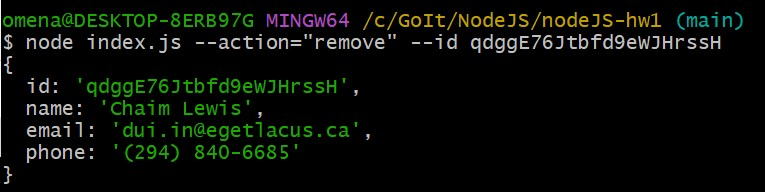

<h1>CLI додаток роботи з контактами</h1>

<h2>Реалізація функцій:</h2>

<>Отримуємо і виводимо весь список контактів у вигляді таблиці</>

<>Отримуємо контакт по id</>

<>Додаємо контакт</>

<>Видаляємо контакт</>

<>Результат після дій користувача</>

