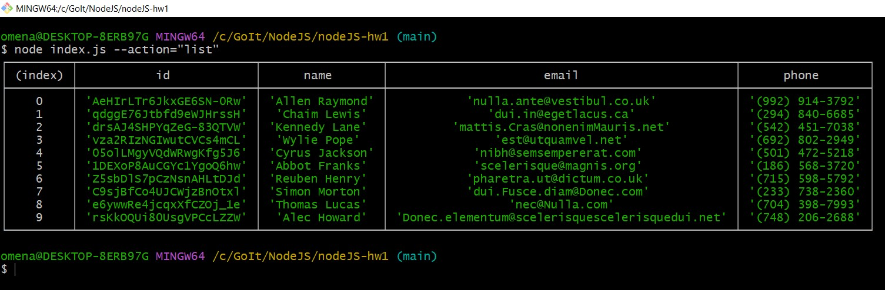
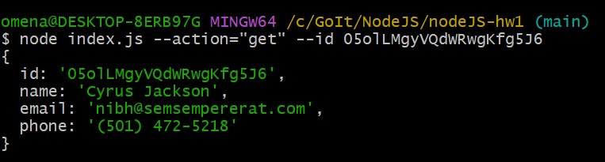
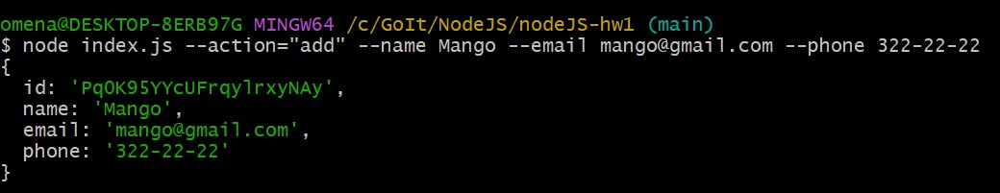
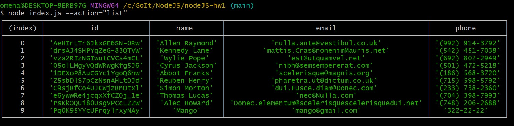

<h1>CLI додаток роботи з контактами</h1>

<h2>Реалізація функцій:</h2>

<b>Отримуємо і виводимо весь список контактів у вигляді таблиці</b>

<b>Отримуємо контакт по id</b>

<b>Додаємо контакт</b>

<b>Видаляємо контакт</b>

<b>Результат після дій користувача</b>

